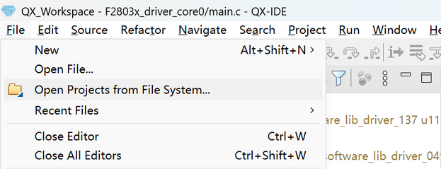
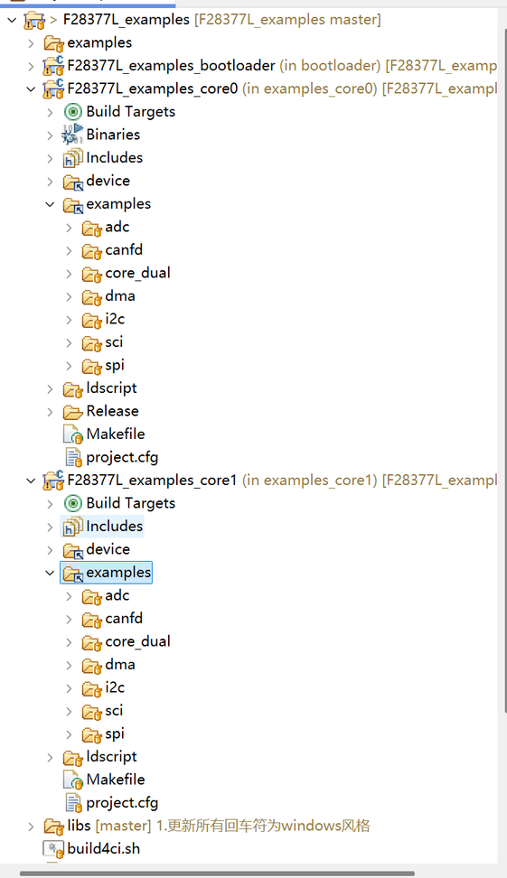
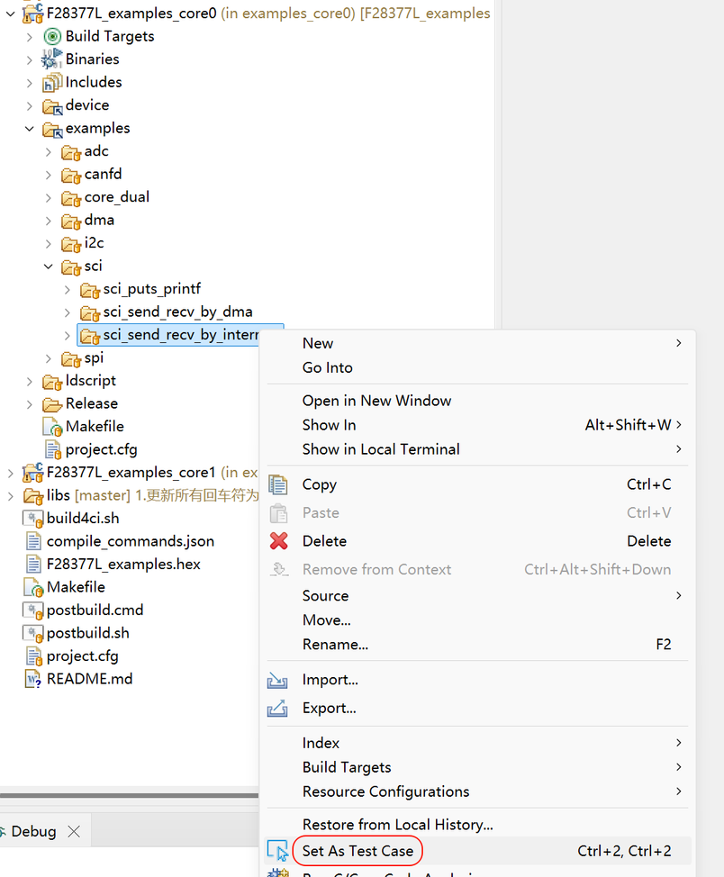
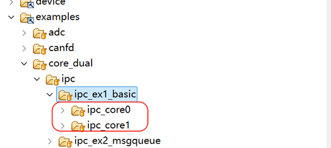
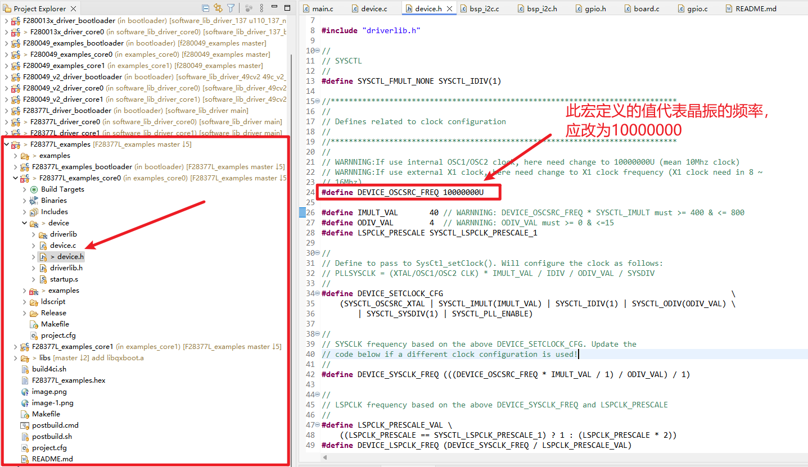
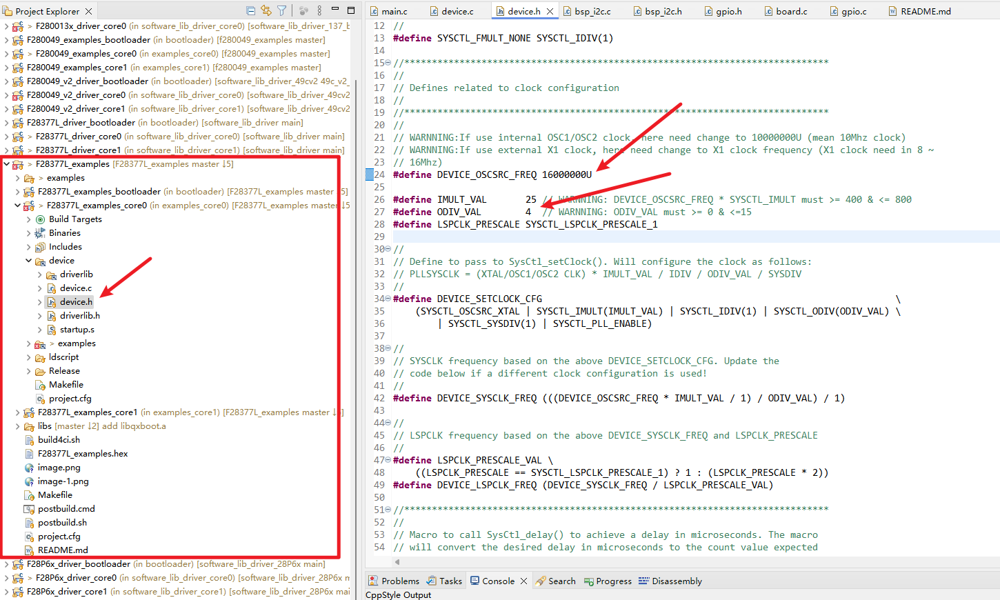

# 1. 例程下载、更新

<span style="color:red">建议选择 **方法1**，以便同步后继例程的扩充和更新。</span>

## 1.1. 方法1（git clone）

1. 下载安装 Git
   - 打开网站 https://git-scm.com/downloads 下载 Git for Windows
   - 安装 Git for Windows，安装时所有选项保持默认即可

2. 打开 Git Bash
   - 安装完成后进入要保存例程源码的目录（目录路径 不要有中文 和 特殊符号）
   - `鼠标右键单击 -> 显示更多选项 -> Open Git Bash here`

3. 下载例程
   - Git Bash中执行以下命令

      `git clone https://gitee.com/starrystonetech-ic/f280049revb_evb_examples.git`
   
4. 更新例程
   - 在例程所在根目录打开Git Bash，依次执行以下命令
      ```
      $ git pull
      ```

## 1.2. 方法2（下载.zip压缩包）

1. 下载例程（不包含设备驱动库）
   - 单击当前页面的 **克隆/下载** -> **下载ZIP** 将直接开始下来zip压缩包到本地:

      

      

4. 更新例程
   - 重复执行以上1个步骤

# 2. 准备开发环境（QX-IDE）
   - 参考[《乾芯DSP开发快速指引》](https://gitee.com/starrystonetech-ic/dashboard/attach_files/2066437/download)第一章节，下载、安装、升级 QX-IDE
   - 为进一步方便下载 QX-IDE，见下载链接如下
      - 百度网盘：https://pan.baidu.com/s/1bfo-FDc_qO7cY8KOFM-vMg 提取码: qide
      - 夸克网盘：https://pan.quark.cn/s/a4fccb17121f 提取码：B6Kg
   - 使用教程
      - [QX-IDE 视频教程](https://www.bilibili.com/video/BV142kuYQEKD/?spm_id_from=333.337.search-card.all.click&vd_source=de957c18e3bfdcf7c8f8f494a8ca45ae)
      - [《QX-IDE用户手册》](https://gitee.com/starrystonetech-ic/dashboard/attach_files/2067676/download)
      - 芯片资料及更多指引 见 QX-IDE 欢迎页面

# 3. 例程导入 QX-IDE
参考[《QX-IDE用户手册》](https://gitee.com/starrystonetech-ic/dashboard/attach_files/2067676/download)章节4.2，简述如下
   - 运行QX-IDE，菜单栏单击 **File -> Open Projects from File System...**

      </img>
   
   - 在弹出的窗口单击 **Directory...**，选择样例根目录；选择希望导入的工程（简介如下），单击 **Finish**
      - bootloader：初始化core0/core1程序的运行环境，无修改需求可不导入
      - examples_core0：DSP core0 工程
      - examples_core1：DSP core1 工程

      </img> 

# 4. 例程编译
所有外设的例程都在本Git仓库中，可通过简单的鼠标操作，选择需要的例程编译。

## 4.1. 目录结构
QX-IDE导入例程所有子目录后，目录结构如附图所示
- F280049RevB_examples_bootloader
   - 芯片bootloader工程
   - 初始化应用程序执行环境；无定制需求可不关注、不导入，无需单独编译
- F280049RevB_examples_core0
   - DSP core0 工程
   - **除双核例程外，所有例程执行在core0上**
   - 其中，`F280049RevB_examples_core0/examples`目录包含所有例程，每个子目录包含单一外设的所有例程
- F280049RevB_examples_core1
   - DSP core1 工程
   - **仅在编译双核例程 `examples/core_dual/` 时使用**

   </img>

## 4.2. 编译
### 4.2.1. 单核例程
- **在core0工程中** 找到`examples/`目录下外设的一个例程目录
- 鼠标右键单击例程目录，选择 **Set As Test Case**即可编译例程

例如，下图显示编译SCI外设例程`sci_send_recv_by_interrupt`。

   </img>

### 4.2.2. 双核例程
双核例程位于`examples/core_dual/`，要编译双核例程，依次执行以下步骤
   - **在core0工程下** 编译core0例程（如图中的`ipc_core0`）
   - **在core1工程下** 编译core1例程（如图中的`ipc_core1`）

   </img>

### 4.2.3. 编译过程中的额外操作
QX-IDE 编译core0/core1工程时，后台还执行以下操作
- 编译bootloader
- 打包bootloader、core0、core1程序为flash镜像

# 5. 片上调试及Flash烧写
参考[《QX-IDE用户手册》](https://gitee.com/starrystonetech-ic/dashboard/attach_files/2067676/download)相关章节。

# 6. 时钟配置更改
需根据开发板上的晶振类型对程序晶振配置进行更改，目前开发板上的晶振有10M和16M之分。
- 10M晶振为例



图中配置的主频为：DEVICE_OSCSRC_FREQ * IMULT_VAL / ODIV_VAL = 100M

- 16M晶振为例



图中配置的主频为：DEVICE_OSCSRC_FREQ * IMULT_VAL / ODIV_VAL = 100M
# f280049revb_evb_examples
