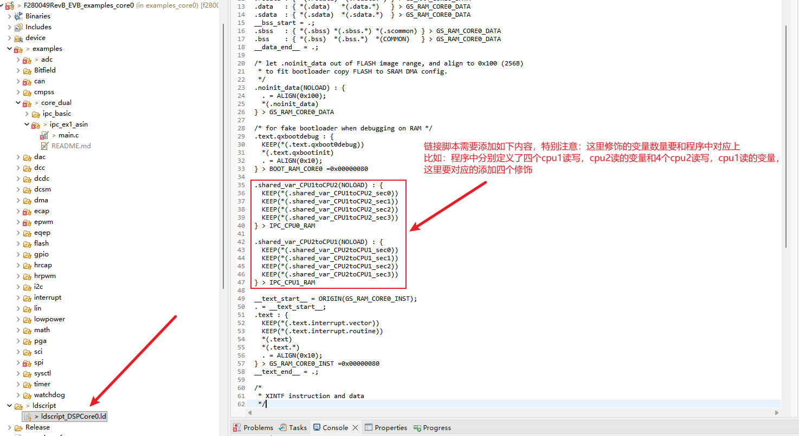
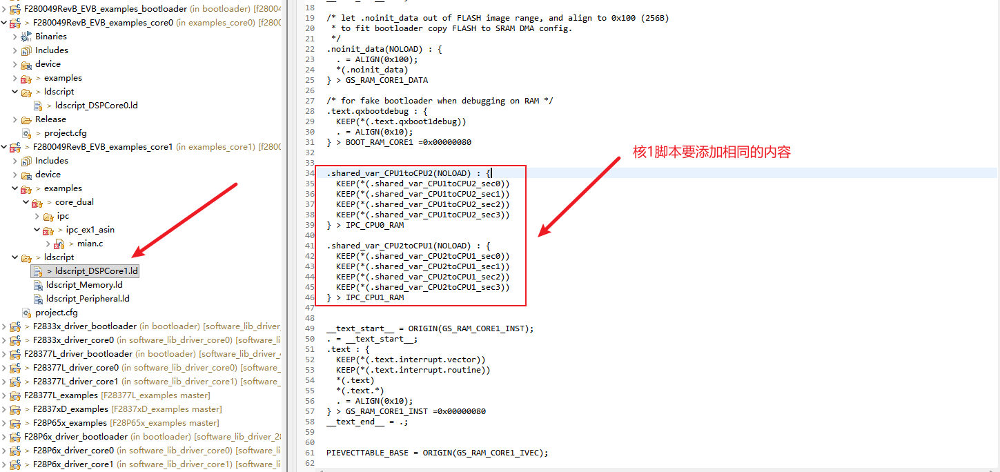

#### 文件所有
本文适用于QXS320F28XXX系列芯片的CPU2进行运算，CPU1获取运算结果的双核示例例程
* * *

#### 版权说明
目前的固件只是为了给使用者提供指导，目的是向客户提供有关产品的代码信息，
与使用者的产品信息和代码无关。因此，对于因此类固件内容和（或）客户使用此
处包含的与其产品相关的编码信息而引起的任何索赔，合肥乾芯科技有限公司
不承担任何直接、间接或后果性损害赔偿责任
* * *

#### 使用说明
- 本例程主要展示了如何使用QX双核功能替代TI的单核+CLA
- 本例程对TI的CLA例程：cla_ex1_asin进行了移植，使用核间通信设置事件来触发CPU2的IPC中断执行，这就等同于TI触发CLA task的执行
- Cpu2DoneIsr等同于TI的CLA task完成中断

#### 特别注意
- 对于双核需要交互的变量，需在两个核的程序中同时对变量进行修饰
- __shared_var_CPU1toCPU2修饰宏的作用是将变量定义在IPC_RAM0中，该地址空间的变量权限为CPU1读写，CPU2只读
- __shared_var_CPU2toCPU1修饰宏的作用是将变量定义在IPC_RAM1中，该地址空间的变量权限为CPU2读写，CPU1只读
- 在两个核代码中分别添加修饰变量的代码，就可以将两边的变量放在相同IPC_RAM地址，两个核就可以对此变量进行读写操作
- 对于两个核同时需要写操作的变量，可以将变量定义在IPC_RAM1空间中，这样在CPU1中可以通过DMA的方式对此空间进行写操作，CPU2就正常读写就可以了
- 链接脚本的修改

  </img> 

  </img> 

#### 硬件
- 无连接
